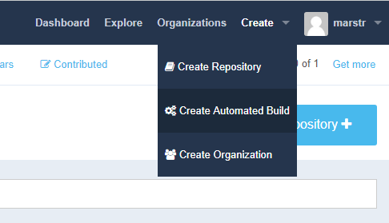
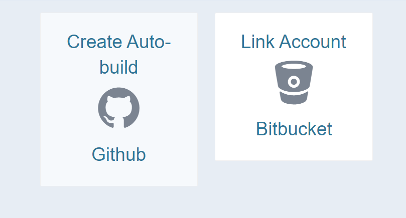

## Continuous Deployment using GitHub and Docker Hub Repositories

#### Pre-Requisites

- Your Buffalo application's source code must be available in a public GitHub repository.
- You must have "Admin" access to the GitHub repository.
- You must have a Dockerfile in the root of your repository.
- You must have Docker Hub account.

### Step-By-Step

1. Ensure your code is up-to-date on GitHub, using `git push`.
1. Navigate a web browser to https://hub.docker.com.
1. Create an Automated Build by clicking through the "Create" menu at the top of the screen:

1. Ensure your GitHub account is linked to your Docker Hub account.
1. Select "Create Auto-build Github" (This step can be slow as it loads all repos you have access to, be patient):  

1. Select the repository that contains your project.
1. Navigate to your "App Service" in the Azure portal.
1. Click on the "Container Settings" option.
1. In the "Continuous Deployment" section, switch it "On".
1. Click on "Show Url", and copy the "WEBHOOK URL"
1. Navigate back to the Automated Build in Docker Hub.
1. Click on the "Webhooks" tab
1. Add a Webhook by clicking on the "+" sign.
1. Give the webhook an appropriate name, like "Publish-App"
1. Paste the URL from your App Service.
1. Click "Save"